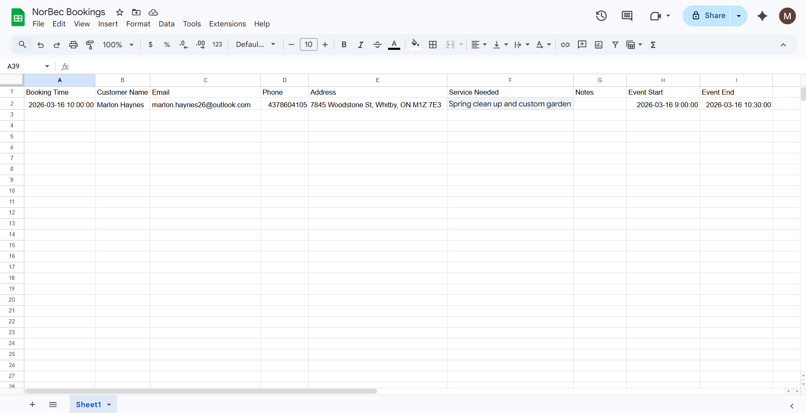

# NorBec Landscaping Booking Website

A modern service booking website built with **React + Vite** that demonstrates a real-world **automated scheduling system** using **Calendly, Zapier, Google Sheets, and Google Calendar**.

The project showcases how small service businesses can automate appointment scheduling, lead collection, and customer communication **without building a custom backend**.

# Live Demo

https://norbec-landscaping-website.onrender.com

Navigate to the **Booking** page to schedule a landscaping consultation.

# Business Problem

Small service businesses often rely on manual booking methods such as phone calls, text messages, or email.

This creates several common problems:

• missed calls while workers are on job sites  
• lost customer information  
• scheduling conflicts  
• no organized record of leads  
• time wasted responding to basic booking requests  

This project demonstrates how a **simple automation pipeline** can solve these problems using modern web tools.

Customers can schedule appointments directly from the website while the system automatically:

• schedules the appointment  
• records the customer information  
• notifies the business owner  
• stores the lead in a structured database  

The result is a lightweight booking system that reduces manual work and improves customer experience.

# Booking Automation Workflow

The website integrates multiple services to create a fully automated scheduling pipeline.

Customer  
↓  
Website (React)  
↓  
Calendly booking system  
↓  
Zapier automation  
↓  
Google Sheets lead database  
↓  
Google Calendar event creation  
↓  
Email notification

This allows the business owner to manage appointments automatically without manual scheduling.

# Booking Page (Live Website)

Customers can schedule a landscaping consultation directly from the website.

# Calendly Booking Form

The embedded Calendly form collects important customer information including:

• customer name  
• email address  
• phone number  
• property address  
• requested landscaping service  
• additional notes

# Google Calendar Integration

Once a booking is submitted, the appointment is automatically created in the business owner's calendar.

This prevents double bookings and keeps scheduling organized.

# Customer Lead Database (Google Sheets)

Customer information is automatically stored in a Google Sheets document, creating a simple CRM-style lead database.

Stored data includes:

• booking time  
• customer name  
• email  
• phone number  
• property address  
• requested service  
• appointment start time  
• appointment end time

This allows business owners to track leads and follow up with potential customers.

# Zapier Automation

Zapier connects the services together and automates the workflow:

1. Calendly detects a new booking  
2. Zapier sends the booking data to Google Sheets  
3. Zapier sends an email notification  

This entire pipeline runs automatically without manual intervention.

# Tech Stack

Frontend

• React  
• Vite  
• JavaScript  
• CSS  

Automation & Integrations

• Calendly  
• Zapier  
• Google Sheets  
• Google Calendar  
• Gmail  

Deployment

• Render

# Key Features

• Responsive service business website  
• Embedded Calendly booking system  
• Automated scheduling workflow  
• Customer data collection  
• Google Sheets lead tracking database  
• Automatic email notifications  
• Google Calendar appointment creation  
• No backend required

# Project Structure

norbec-landscaping-website

public
│
├── images
│
└── project-docs
├── Live site booking.png
├── Live site booking 1.png
├── Google calendar.png
├── Sheets.png
└── Zapier workflow.png

src
│
├── components
│ ├── Home.jsx
│ ├── Services.jsx
│ ├── Booking.jsx
│ ├── Contact.jsx
│ └── Layout.jsx
│
├── App.jsx
├── main.jsx
└── index.css

index.html
package.json
vite.config.js

# Running the Project Locally

Clone the repository

git clone https://github.com/WebAlchemistLabs/norbec-landscaping-website.git

Navigate into the project directory

cd norbec-landscaping-website

Install dependencies

npm install

Run the development server

npm run dev

Open in browser

http://localhost:5173

# Real-World Use Case

This architecture is commonly used by small service businesses that want a professional booking system without building a full backend application.

Examples include:

• landscaping companies  
• cleaning services  
• contractors  
• personal trainers  
• consultants  
• home service providers  

The same workflow can be adapted to many different service-based businesses.

# Author

Marlon Haynes

Software Engineering Technology Student  
React Developer | Automation Systems | UX Design

GitHub  
https://github.com/WebAlchemistLabs

Built by **Web Alchemist Labs**